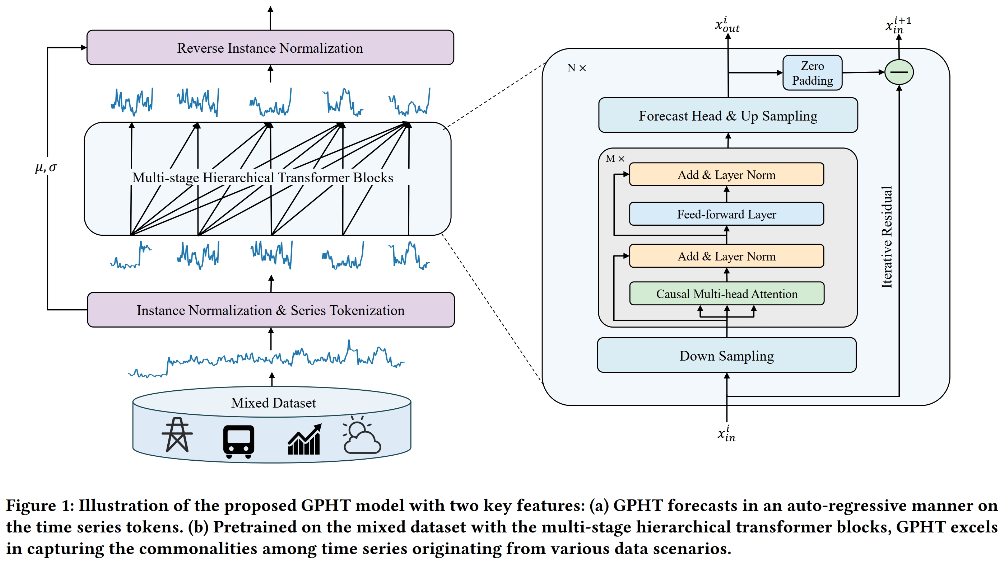
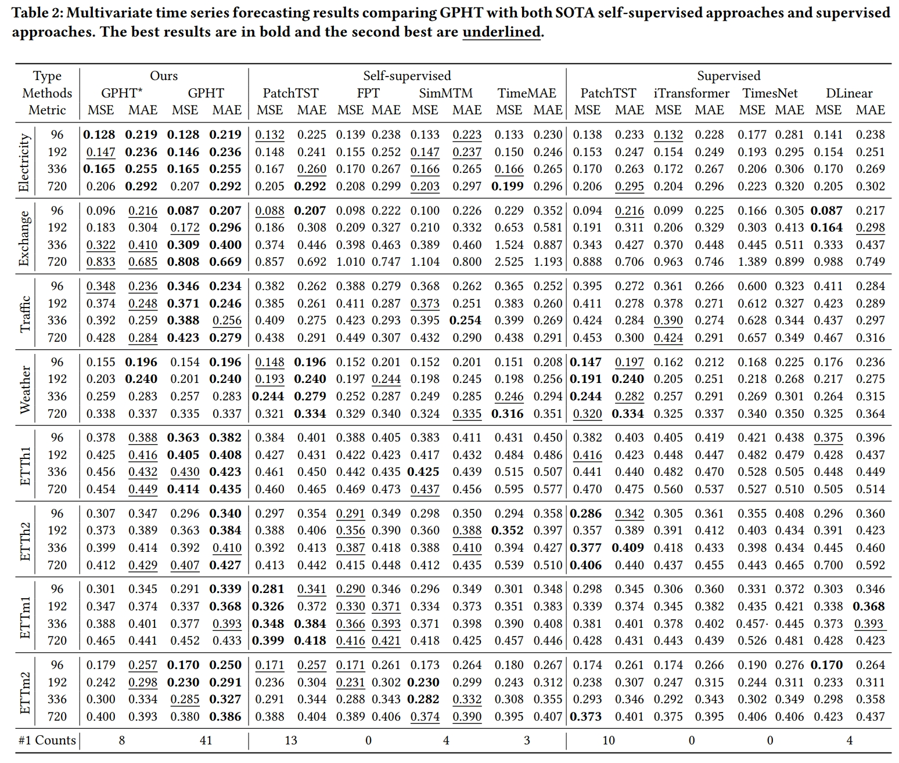
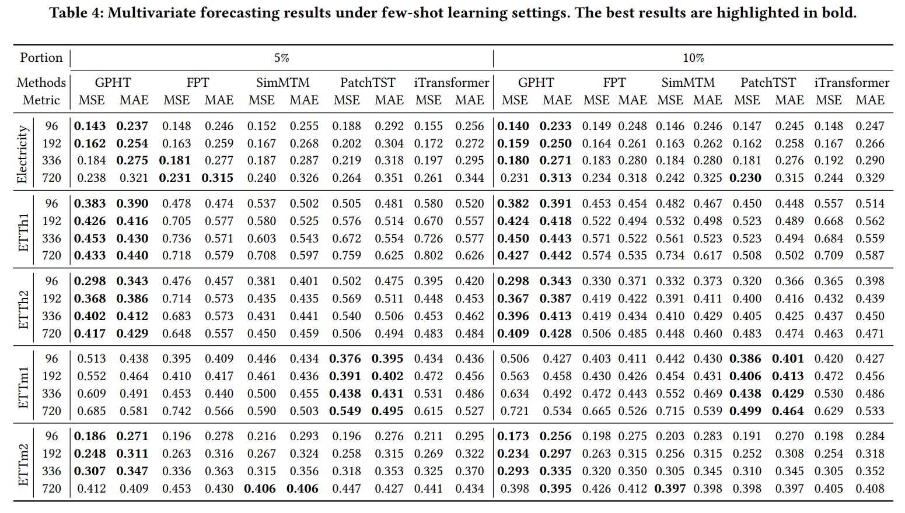
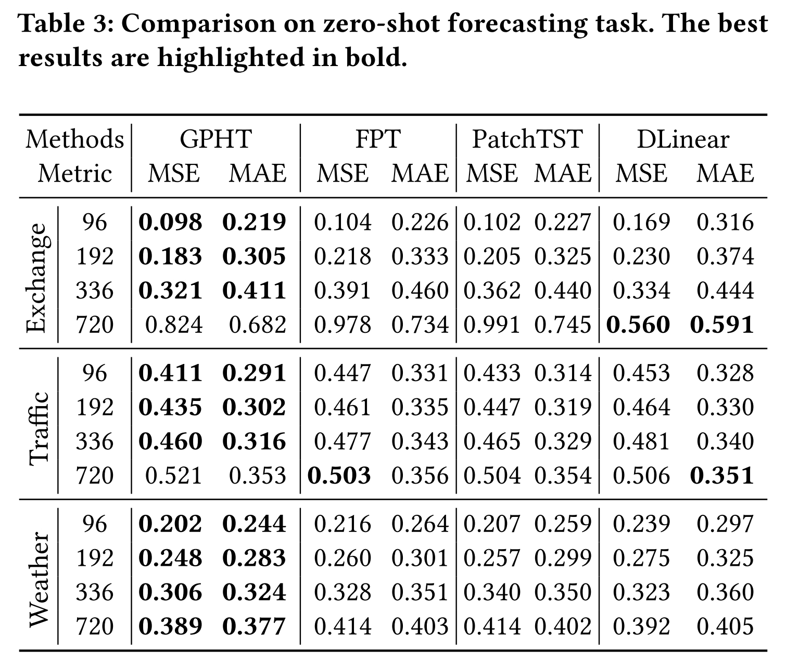

## GPHT (KDD 2024)

This repo is the official Pytorch implementation of our KDD 2024 paper: Generative Pretrained Hierarchical Transformer for Time Series Forecasting. 


### Introduction

We propose the Generative Pretrained Hierarchical Transformer (GPHT) model to explore training a single unified forecasting model that generalizes well across diverse data scenarios and forecasting settings. The approach stands out in three aspects:

- **Pretraining**. We extend the channel-independent assumption to build a mixed dataset, treating time series originating from various scopes as a whole. We then conduct pretraining on the mixed dataset to make full use of the inherent diverse patterns for benefiting models' generalizability. 
- **Auto-regressive forecasting**. GPHT forecasts in an auto-regressive manner both in the training and inferencing procedure. Compared to the conventional one-step generation schema, our approach can better model the temporal dependencies within the predicted series. Furthermore, since no customized forecasting head tailored for certain horizon length settings, GPHT can flexibly forecast at arbitrary horizon lengths.
- **Hierarchical architecture**. We introduce the hierarchical decoder-only transformers with the iterative residual learning strategy in GPHT, enabling the model to capture the multi-scale representations and the diverse patterns in the mixed dataset.




### Performance

We conduct comparison experiments on 8 widely used datasets with mainstream self-supervised pretraining methods and supervised methods. Results demonstrate that our method surpasses the baseline models across various fine-tuning and zero/few-shot learning settings in the traditional long-term forecasting task.  

**Full data results**



**Few shot results**



**Zero shot results**




### Usage

We provide the default hyper-parameter settings in `run.py` to perform pretraining, and ready-to-use scripts for fine-tuning on each datasets in `scripts/finetune`.


### Acknowledgement

This repo is built on the pioneer works. We appreciate the following GitHub repos a lot for their valuable code base or datasets:

[Autoformer](https://github.com/thuml/Autoformer)

[Time-Series-Library](https://github.com/thuml/Time-Series-Library?tab=readme-ov-file)


### Citation

If you find this repository useful for your work, please consider citing it as follows:

```bibtex
@inproceedings{liu2024generative,
  title={Generative Pretrained Hierarchical Transformer for Time Series Forecasting},
  author={Liu, Zhiding and Yang Jiqian and Cheng Mingyue and Luo Yucong and Li Zhi},
  booktitle={Proceedings of the 30th ACM SIGKDD conference on knowledge discovery and data mining},
  year={2024}
}
```
